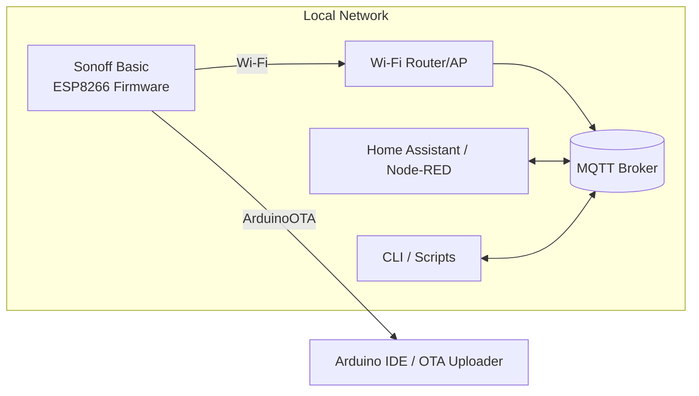

# Sonoff Basic Home Automation (ESP8266 Custom Firmware)

Custom firmware for **Sonoff Basic (ESP8266)** devices to control the relay via **MQTT**, report device status periodically, and support **OTA (ArduinoOTA)** updates over the network.

> Goal: control Sonoff devices with **our own firmware** and integrate them into an MQTT-based home automation stack (e.g., Home Assistant, Node-RED, custom services).

---

## Highlights

- **Wi‑Fi (STA)** connectivity with retry/recovery logic
- **MQTT control** per device (`<device>/request` → `<device>/response`)
- **Periodic status publish** (every **60 seconds**)
- **Fleet/broadcast command** channel (`sonoff_all/request`)
- **Physical button** handling (short/medium/long press)
- **ArduinoOTA** for remote firmware updates

---

## Architecture




For connection Sonoff Basic to UART


For Esp8266 + Relay module (need to change gpio12Relay in the code)

---

## MQTT Topics & Payloads

### Per-device topics (derived from hostname)

- **Request:** `esp8266-<deviceName>/request`  
- **Response:** `esp8266-<deviceName>/response`

#### Accepted request payloads

| Payload  | Action |
|----------|--------|
| `on`     | Relay ON |
| `off`    | Relay OFF |
| `status` | Publish current relay state (`on`/`off`) |

#### Response payload

- `on` / `off` (current relay state)

> The firmware also publishes the state periodically (see **Status Reporting**).

### Fleet / broadcast topics

- **All request:** `sonoff_all/request`  
- **All response:** `sonoff_all/response`

#### Fleet payloads

| Payload   | Action |
|-----------|--------|
| `showip`  | Device publishes `hostname ==> <ip>` to `sonoff_all/response` |

---

## Status Reporting

- The device publishes relay state to `<device>/response` every **60 seconds**.
- It also publishes immediately after:
  - relay toggles
  - `status` request
  - successful MQTT connect

---

## Hardware / Pinout

Default mapping for Sonoff Basic-style boards (adjust in code if needed):

- **Relay:** GPIO12
- **LED:** GPIO13 *(often active‑low: LOW=ON, HIGH=OFF)*
- **Button:** GPIO0 *(active‑low)*

---

## Button Behavior

On GPIO0 (active-low):

- **Short press**: toggle relay
- **Medium press**: restart device
- **Long press**: restart device *(placeholder for “reset settings” behavior if you implement it later)*

---

## Configuration

Create a `config.h` (not committed, or committed as `config.h.example`) with:

- `WIFI_SSID`
- `WIFI_PASSWORD`
- `MQTT_ADDRESS`
- `deviceNames[]`
- `hostNumber`

Example:

```cpp
#pragma once

#define WIFI_SSID     "YourSSID"
#define WIFI_PASSWORD "YourPassword"
#define MQTT_ADDRESS  "192.168.1.10"

// Choose device identity from a list
static const char* deviceNames[] = {"livingroom", "kitchen"};
static const int hostNumber = 0;
```

The firmware constructs:

- hostname: `esp8266-<deviceName>`
- request topic: `esp8266-<deviceName>/request`
- response topic: `esp8266-<deviceName>/response`

---

## Build & Flash

### Option A — Arduino IDE

1. Install **ESP8266** board support (“ESP8266 by ESP8266 Community”).
2. Select a compatible board (commonly **Generic ESP8266 Module** for Sonoff Basic).
3. Configure port and flash settings.
4. Build and upload.

### Option B — PlatformIO

If you use PlatformIO, add your environment and dependencies accordingly (ESP8266 framework, PubSubClient, ArduinoOTA, etc.).

---

## OTA Update (ArduinoOTA)

Once connected to Wi‑Fi, the device appears as an OTA target:

- Hostname: `esp8266-<deviceName>`

Upload using Arduino IDE “Upload via OTA” (or an OTA uploader) on the same network.

---

## Example Commands

### Turn relay ON

Topic:
- `esp8266-<deviceName>/request`

Payload:
- `on`

### Request status

Topic:
- `esp8266-<deviceName>/request`

Payload:
- `status`

### Ask all devices to report IP

Topic:
- `sonoff_all/request`

Payload:
- `showip`

Responses arrive on:
- `sonoff_all/response`

---

## Tested With

This firmware is designed to work with common MQTT home automation stacks, such as:

- **Mosquitto** (MQTT broker)
- **Home Assistant** (MQTT integration)
- **Node‑RED** (MQTT nodes)
- Custom scripts/services publishing to MQTT topics

*(Add your real “tested versions” here if you want it to read even more enterprise.)*

---

## Security Notes

If you’re using this on a real home network, consider:

- **MQTT authentication** (username/password)
- **TLS** (if your broker and device setup supports it; ESP8266 has constraints)
- Restricting MQTT access via:
  - broker ACL rules (topic-level)
  - network segmentation (IoT VLAN)
- Avoid exposing MQTT broker/OTA ports directly to the internet.

---

## Roadmap Ideas (Optional)

- Implement “long press” as a real **settings reset** (EEPROM/LittleFS wipe)
- Add **Last Will and Testament** (LWT) topic for online/offline status
- Add **retain** behavior strategy per message type (status vs command ack)
- Add structured telemetry (RSSI, uptime, IP) to a `<device>/telemetry` topic

---

## License

Add a license (MIT/Apache-2.0/etc.) and include a `LICENSE` file.


